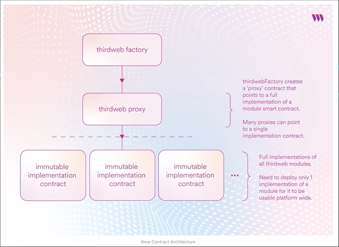
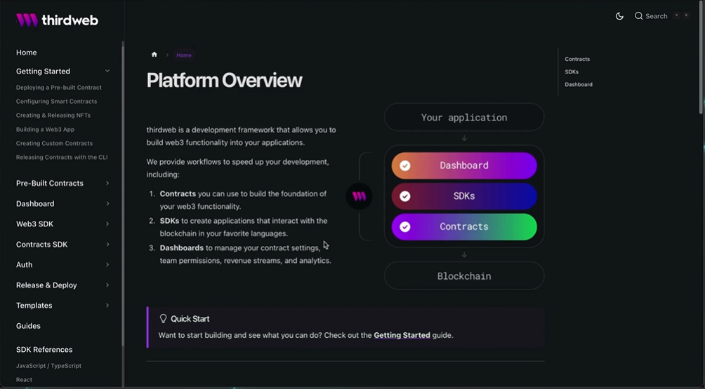

# Benefits of thirdweb

## Speed of Development

- Pre-Built Contracts
- Base Smart Contracts
- Snippets of code from the SDK

## Security

- Dashboard for managing everything you have deployed
- Pre-builds
- SDKs as well

## Cost of usage

- It leverages proxy contracts and removes the filter in between so you only pay for the gas to run the contract.

