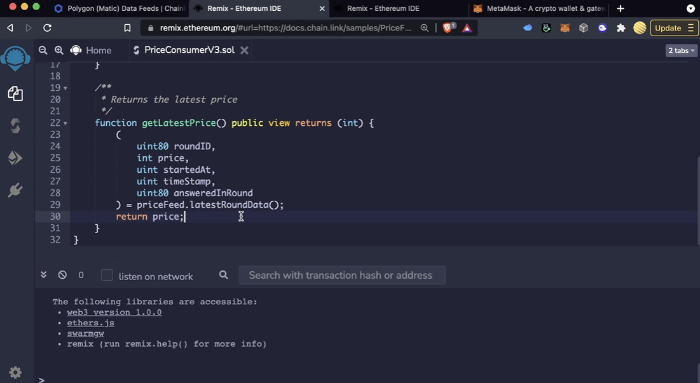

# Out of the box solutions

These Data Feeds have general ledgers that correspond to the various protocols and corresponding assets on those protocols.

Solidity doesn't work with decimals and so we multiply it by a large factor

This code will work on the Polygoin mainnet the exact same way

## Chainlink VRF

2 part process

Need both ETH and _LINK

We are working with the Chainlink chain which is going to do the chekcing our actual random number.

Inherited from the chainlink contracts

The contract has to have gas, not the user but the contract needs _LINK

