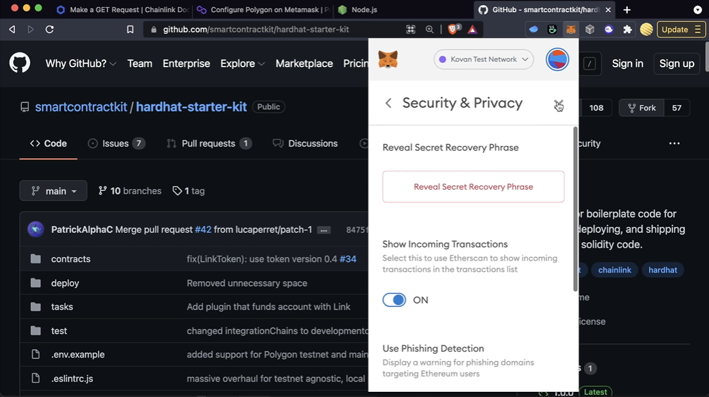

# Deployig using Hardhat

## Hardhat Starter Kit

Import all dependancies
`yarn` or `yarn install` or `npm install`

Starts a fake blockchain on our computer
`npm hardhat node`

It runs through all the deploy scripts

It creates mock contracts

Runs through the scripts and displays the print outputs

We can test everyhting much quicker

## Deploying to a mainnet and not a testnet

This is an example env

Remember to add the '0x' prefix

For your MNUEMONIC

Comment out the parts you don't want to and then leave the rest

## Deploying

`npx hardhat test`

For Polygon go into hardhat config and change the following

We also have to update the helper configuration

