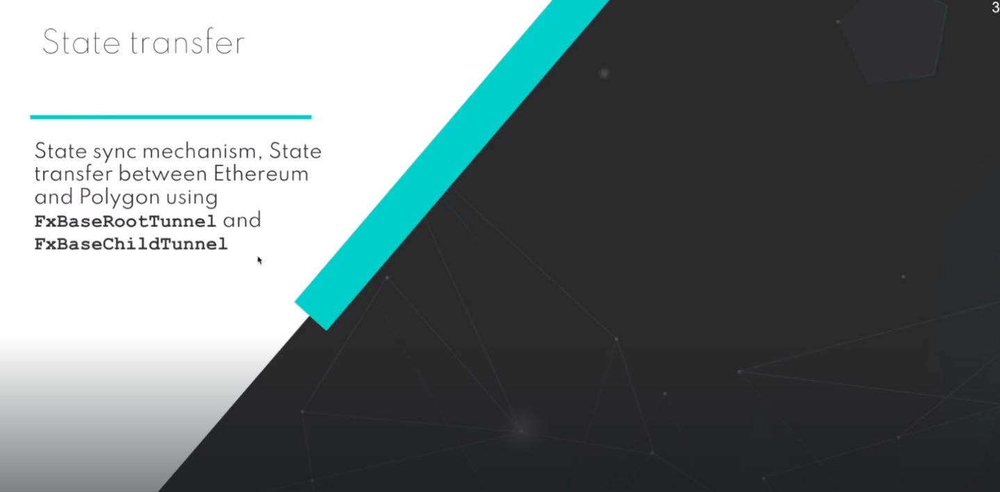
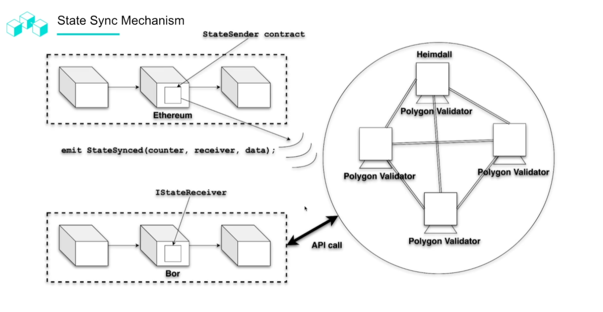
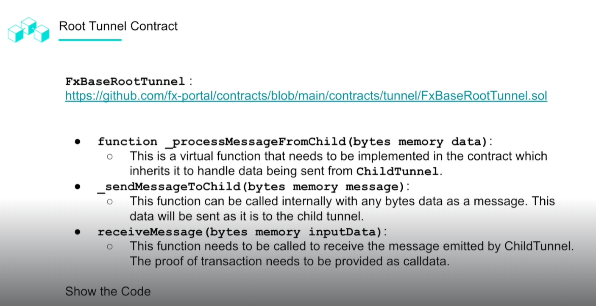
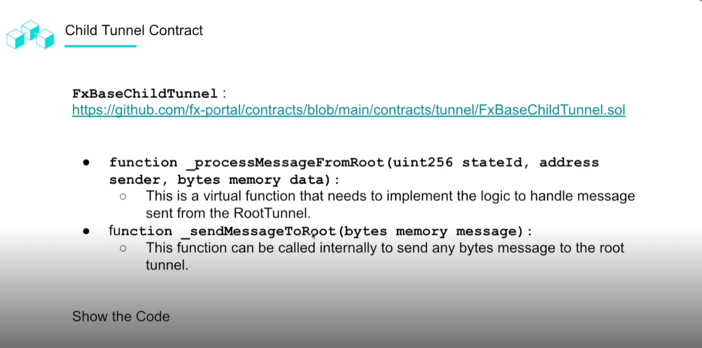
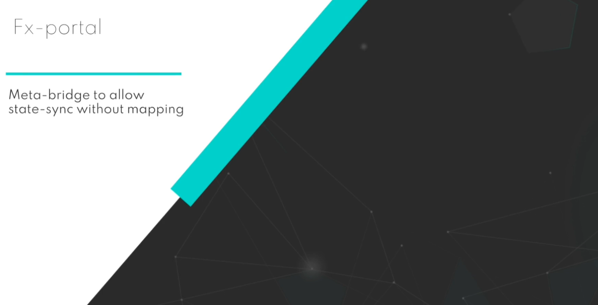
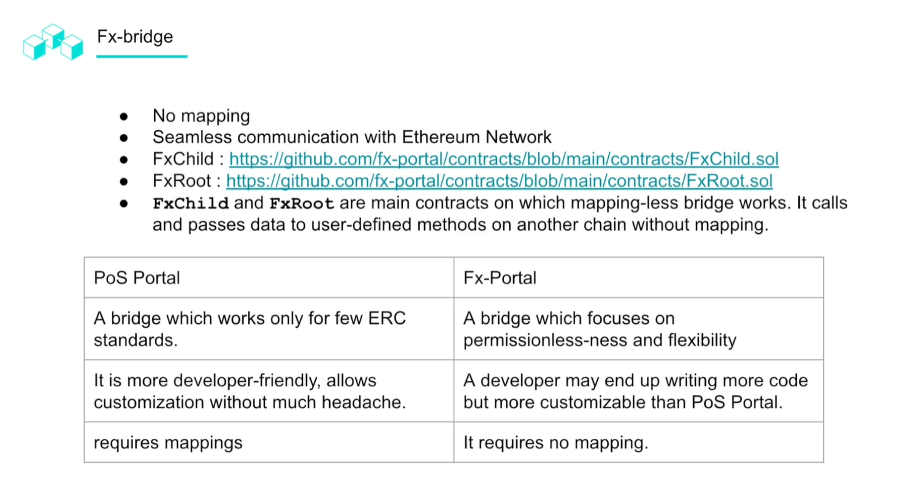
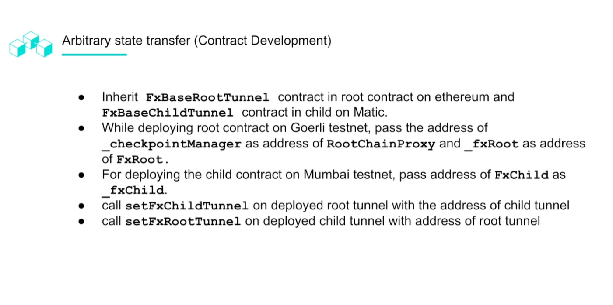
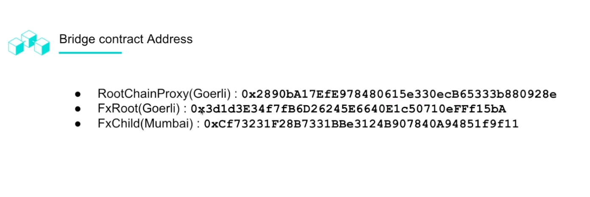
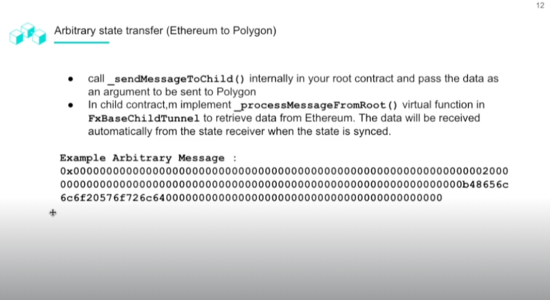
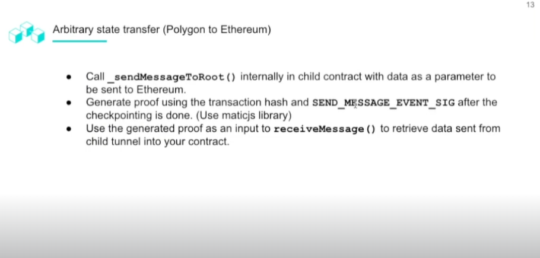

# State Transfer

## State Transfer In-Depth

## FX-Portal

Meta-Bridge: state sync without any mapping.

This is essentially equivalent to the ability to transfer tokens without the need for proper mapping.

This has opened the possibility to map onto alternate protocols so long as they has a method of mapping between different protocols. For example, Arbitrum and Polygon.

## FX-Bridge

Assets will be connected through the Data bridge or the use of internal contracts that will be used to map the data to the corresponding contracts.

