# Mapping assets on PoS

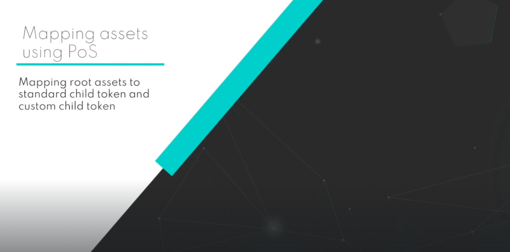

## Standard Child Token Contracts

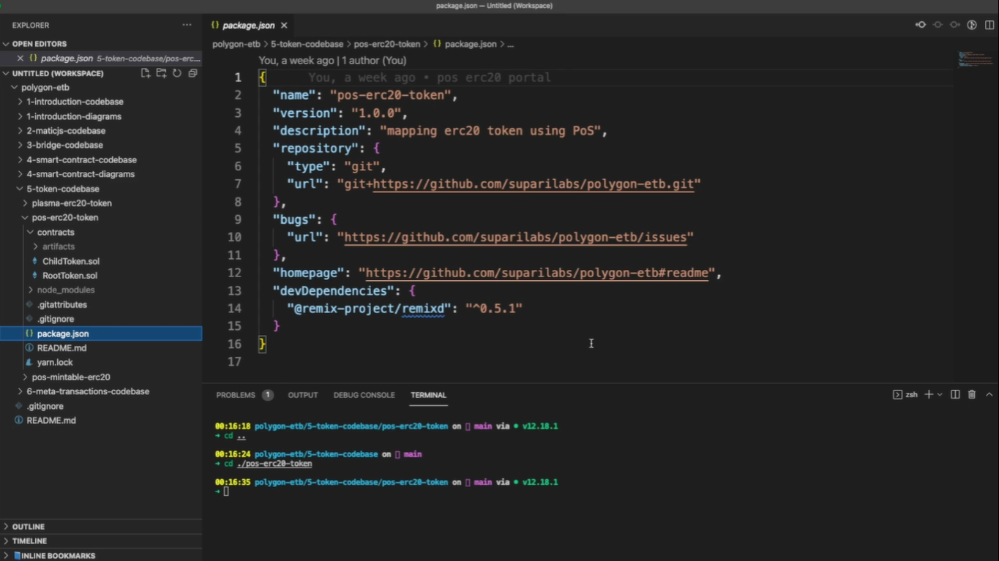

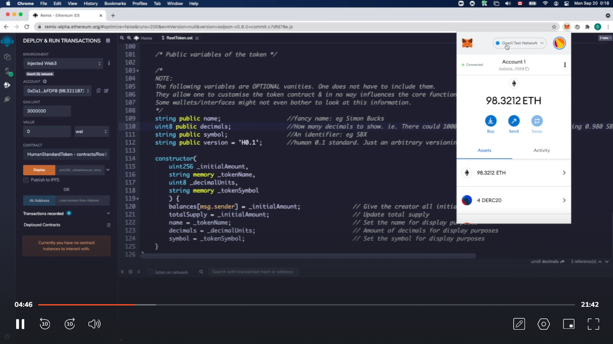
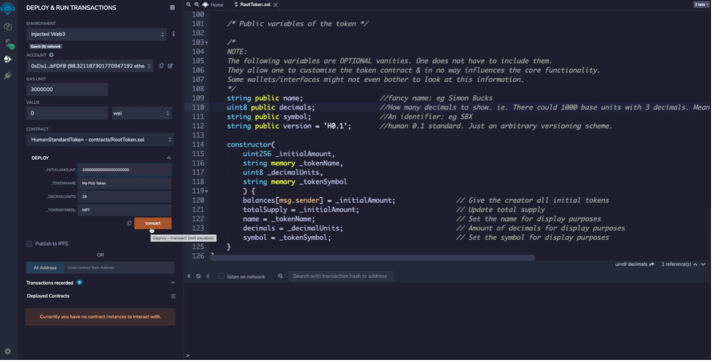
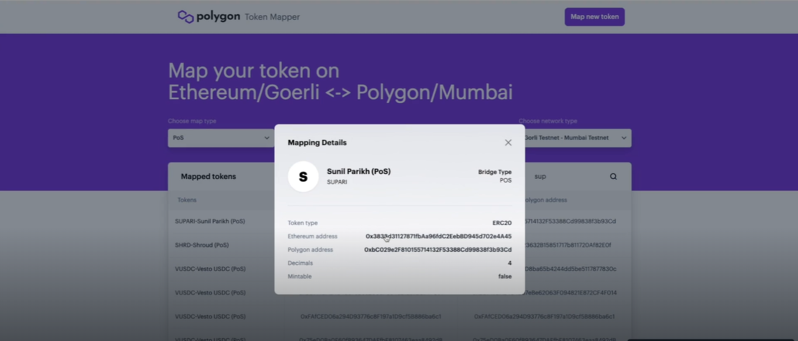
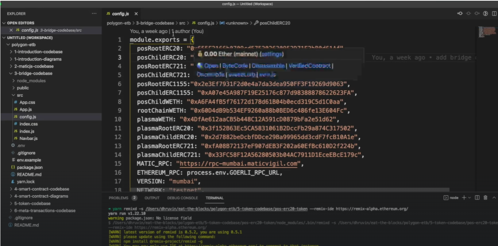
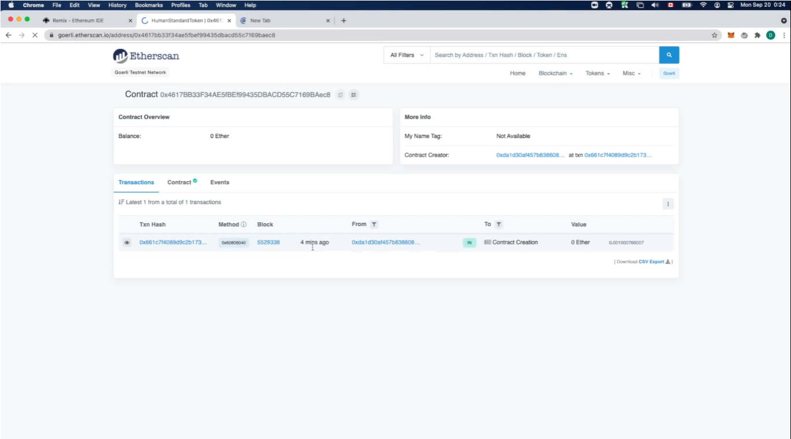
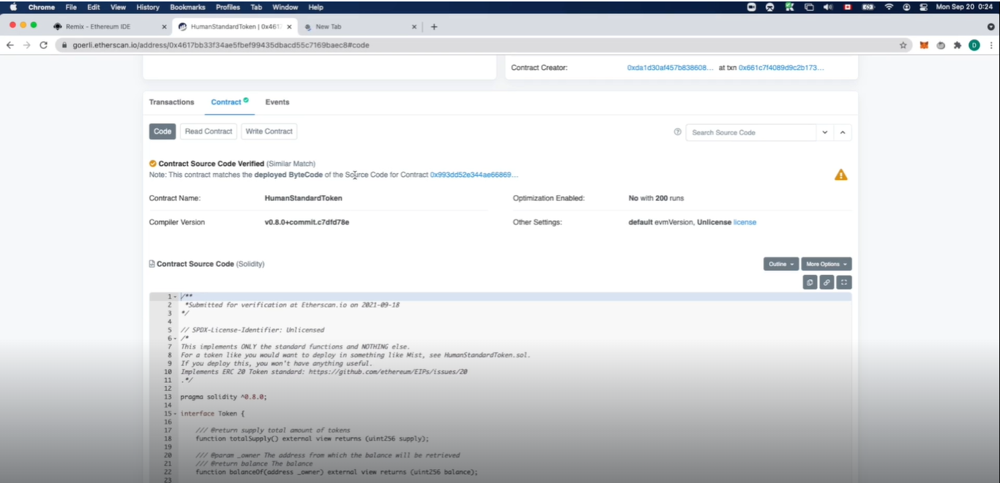

Make sure to update the values based on the number of decimals.
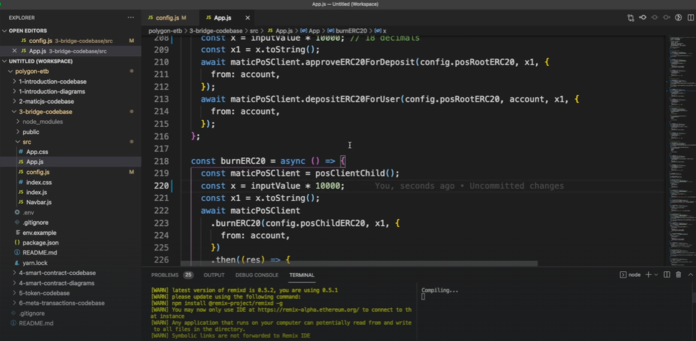

Add the SUPARI token to your wallet
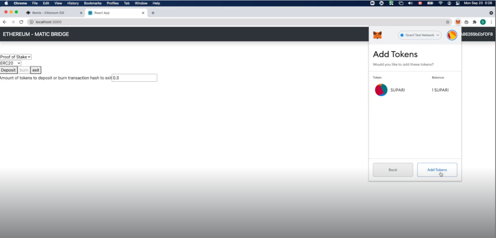
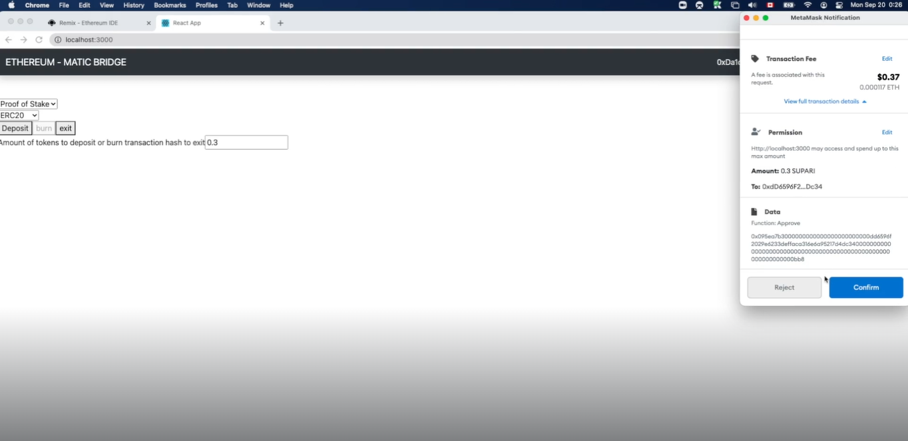
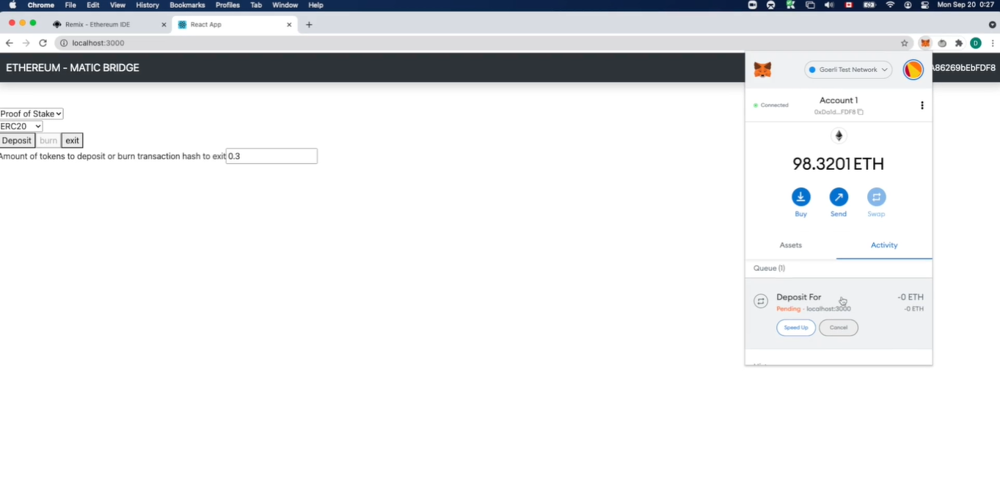

There are certain requirements for the child tokens.

We can also see that our tokens are now visible on the Polygon mapper.
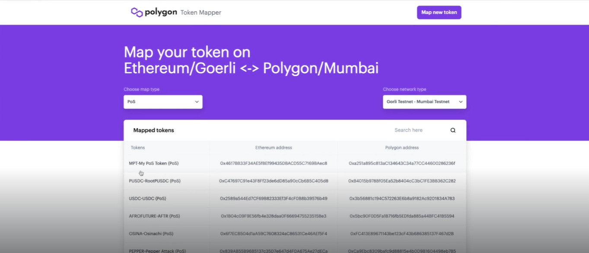
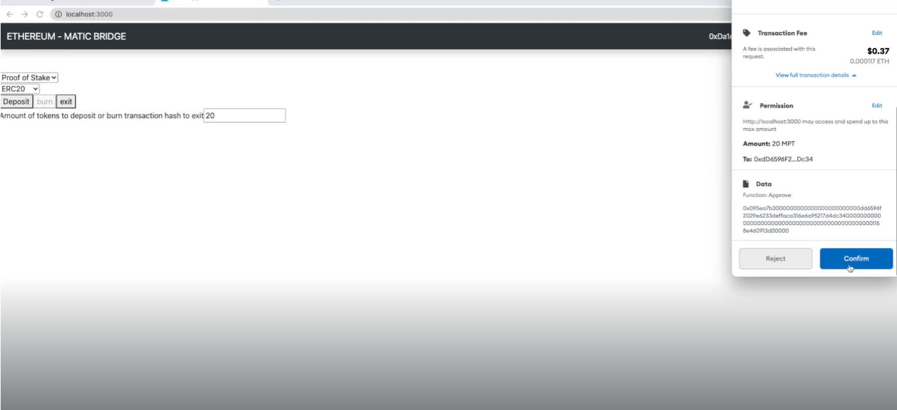

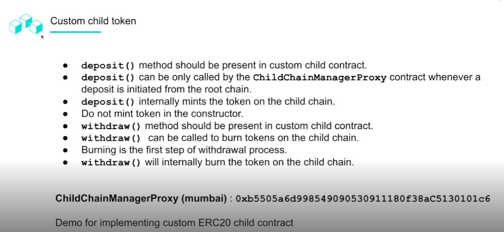
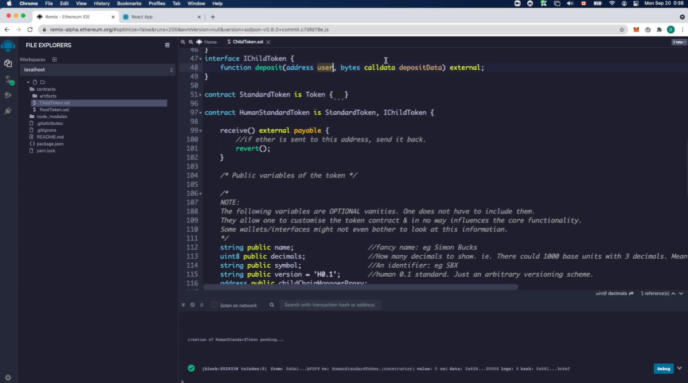

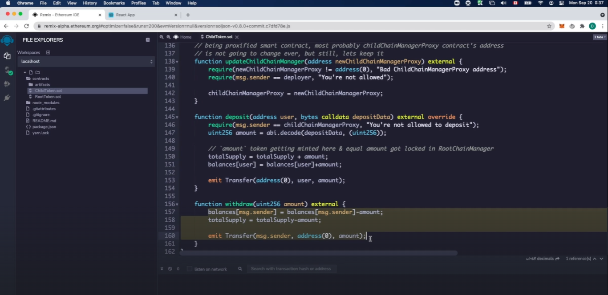

We can start deploying contracts.
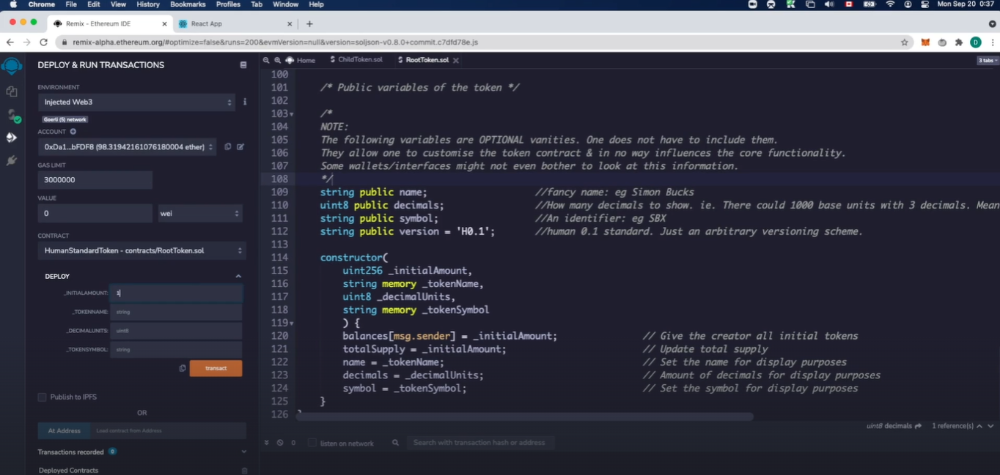

We will have to go and verify the token on the Goerli network.
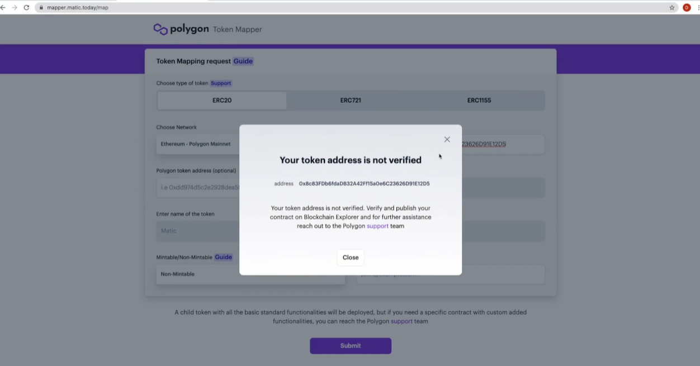
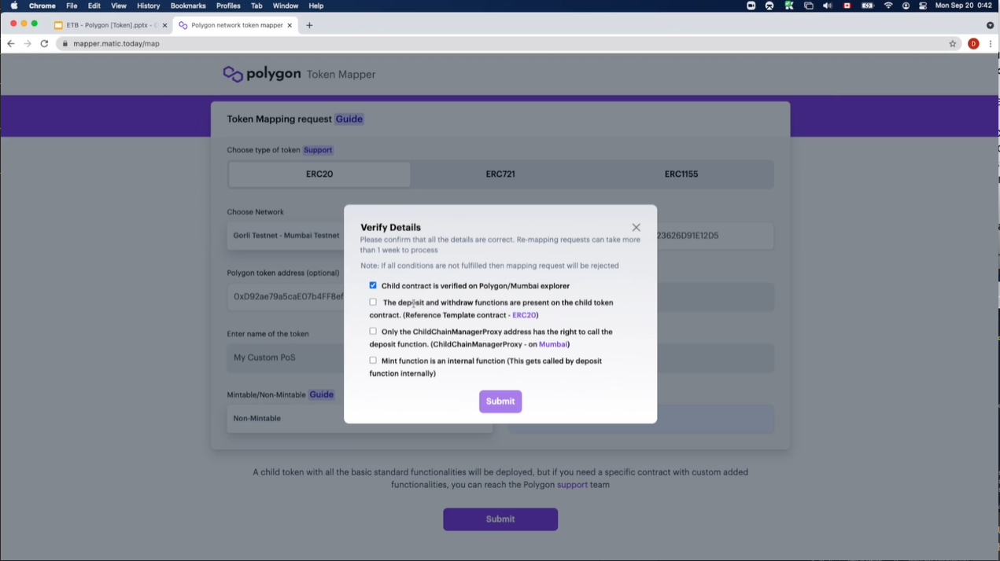

