# Biconomy

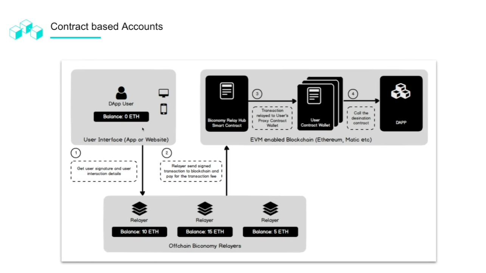
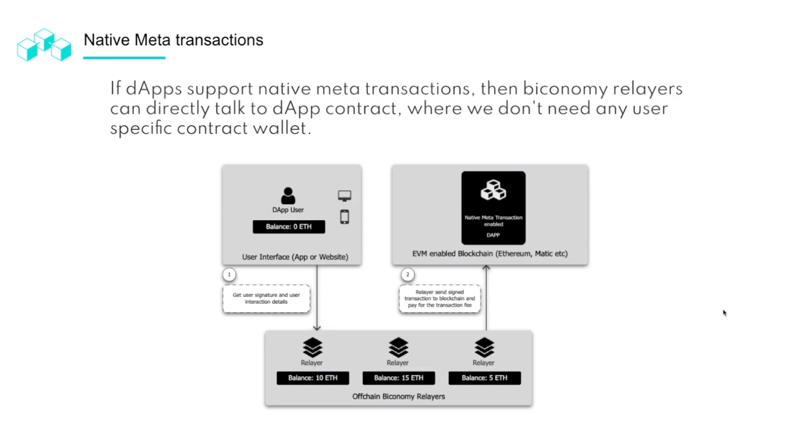
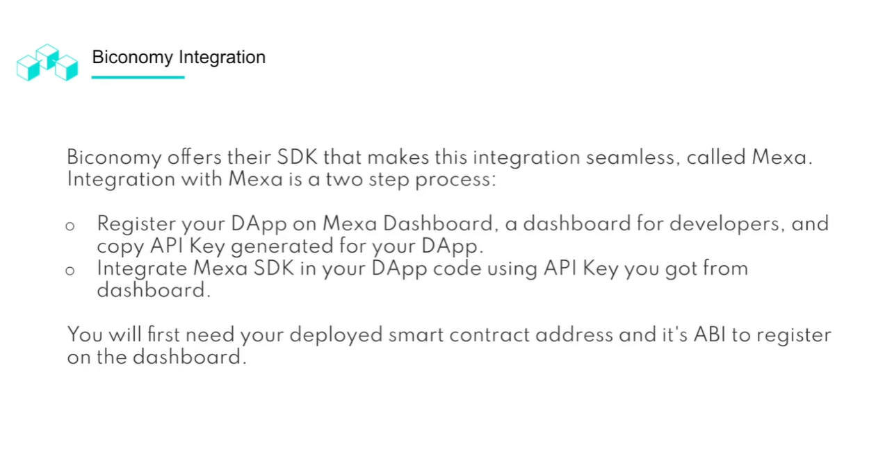

Register your Dapp on Biconomy
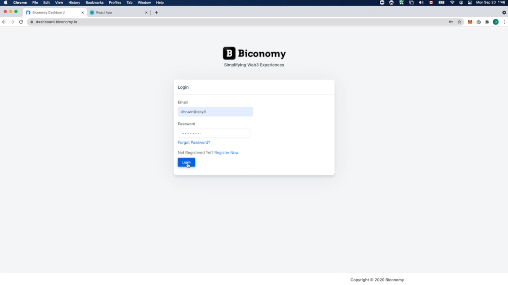
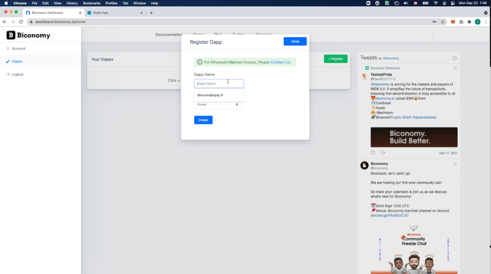

Replace the key in config.js with your new API key

Add contract name and address (ABI)
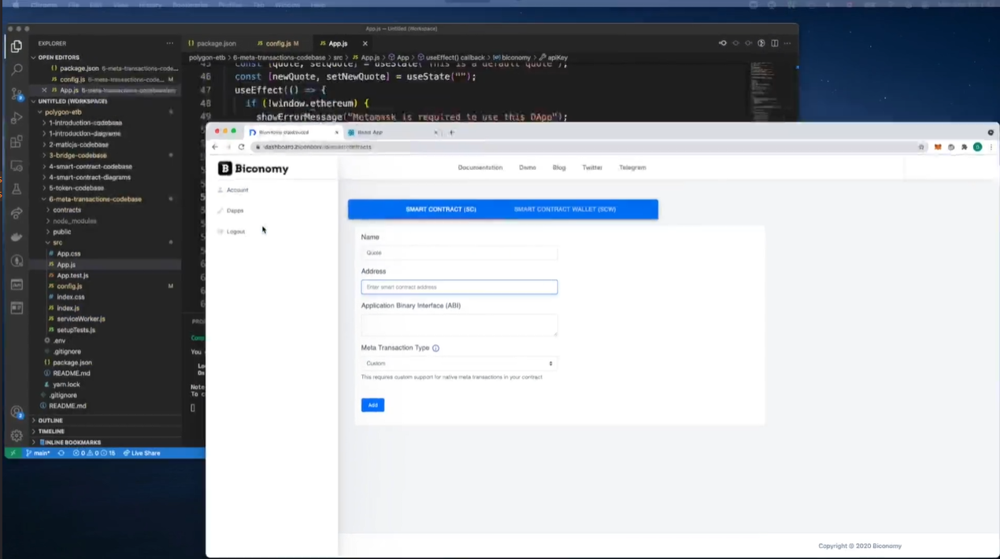
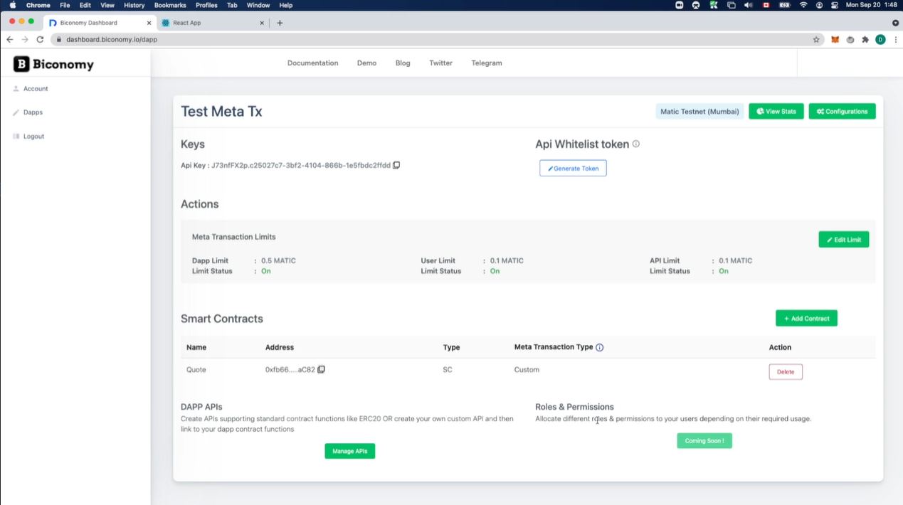
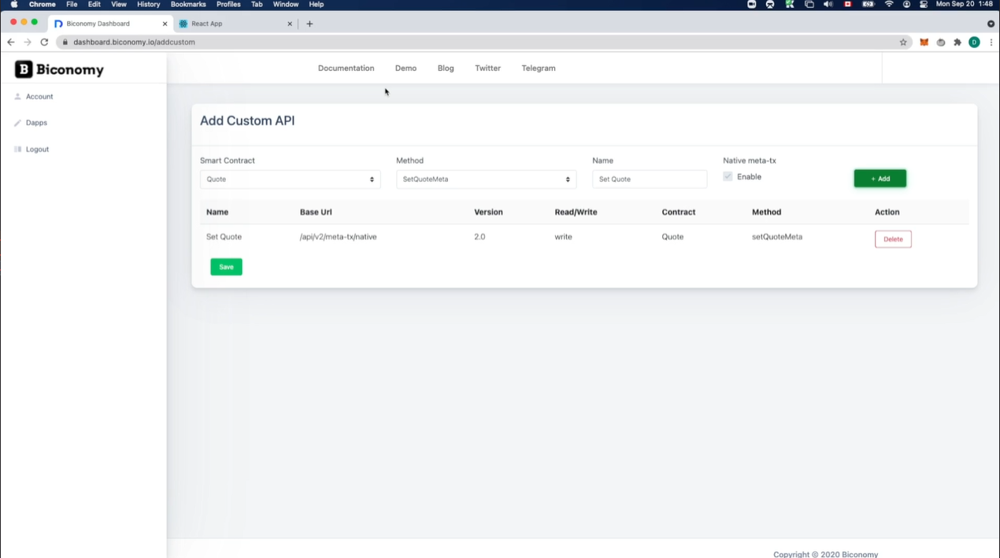

## Biconomy Mexa SDK

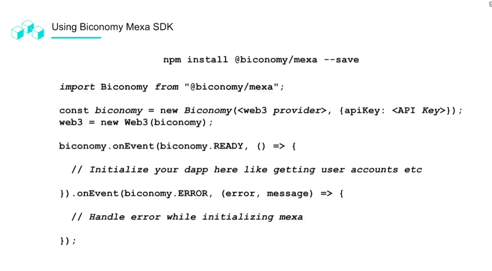
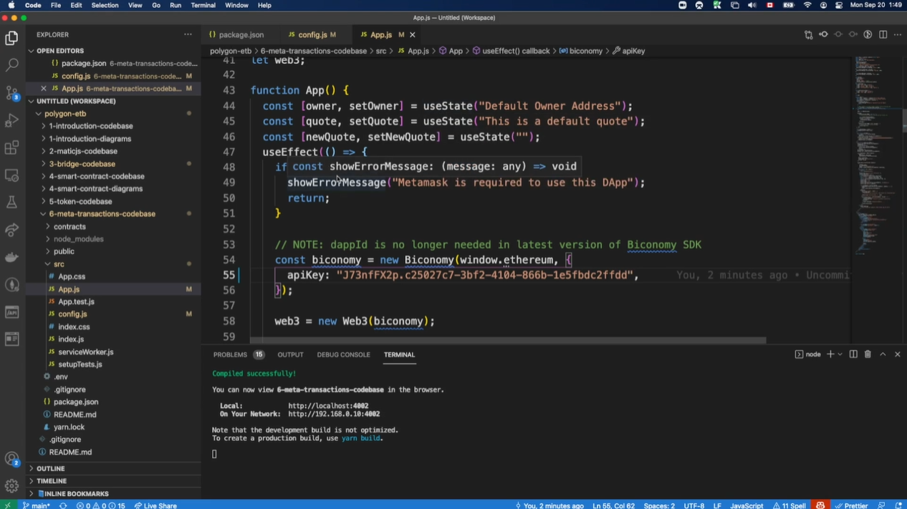

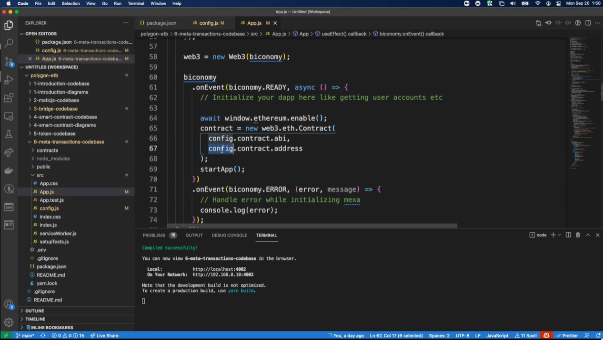

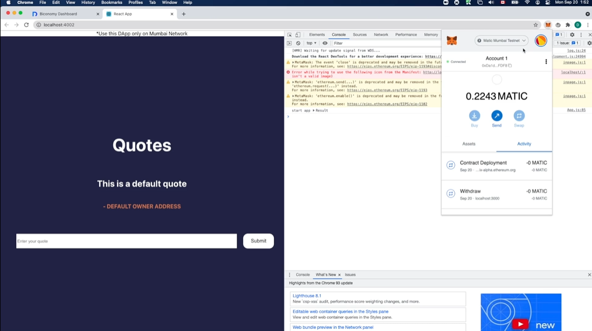
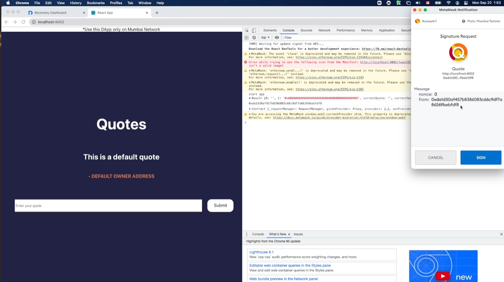

Once the transaction is successful we will see the quote and the default address will changfe to the initial address that ran of the application.

In order to make sure that it is working we will have to add the URL to our Biconomy dapp. 

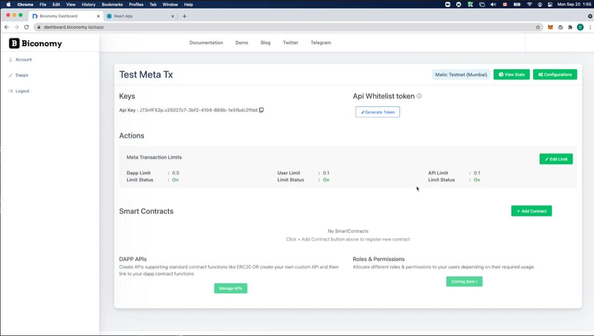
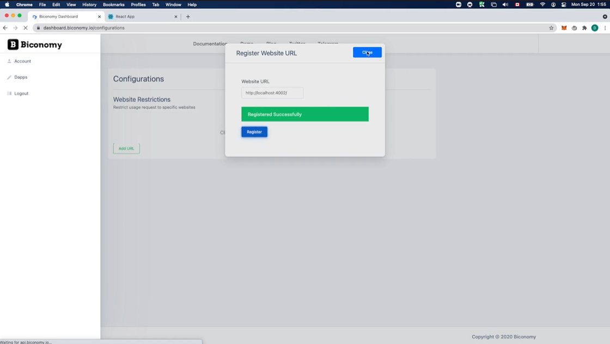

Adding limits
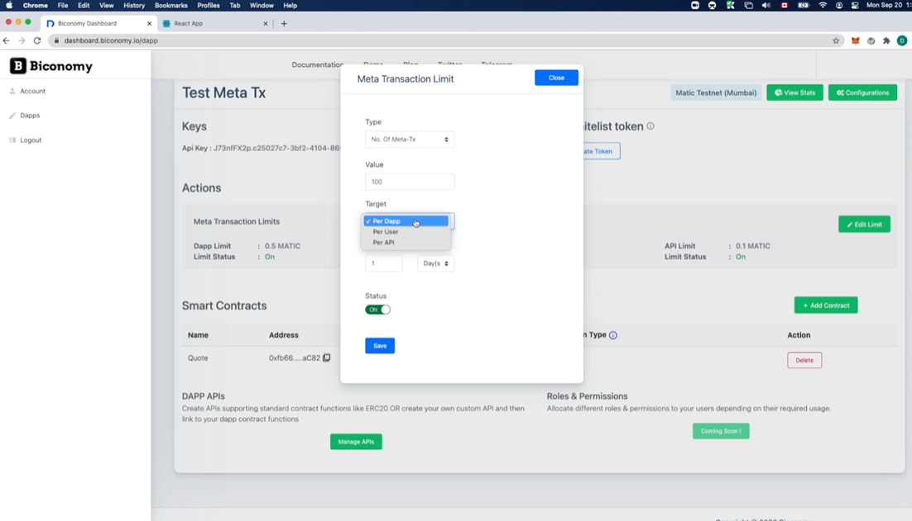

Should show nonce: 1, since we have already interacted with this transaction before.

