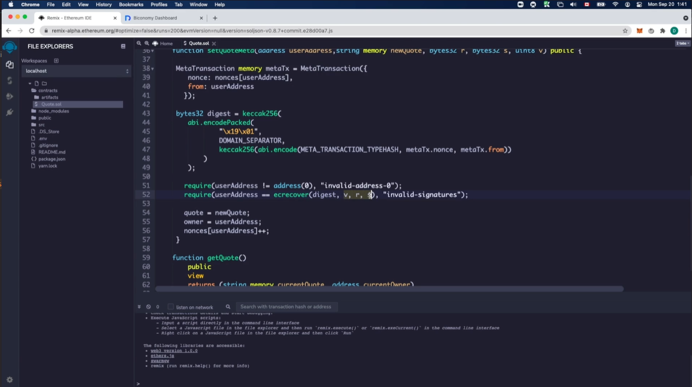

# Meta Transactions

Gasless transactions: allows the users to access data that only needs access to public (private key pairs).
Users have the assets but not the gas to pay for those transactions.

## Introduction to Meta Transactions

## A smart contract that is Meta Transaction compliant

Once the contract is deployed then we need to set the contracts address in the config.js file.

