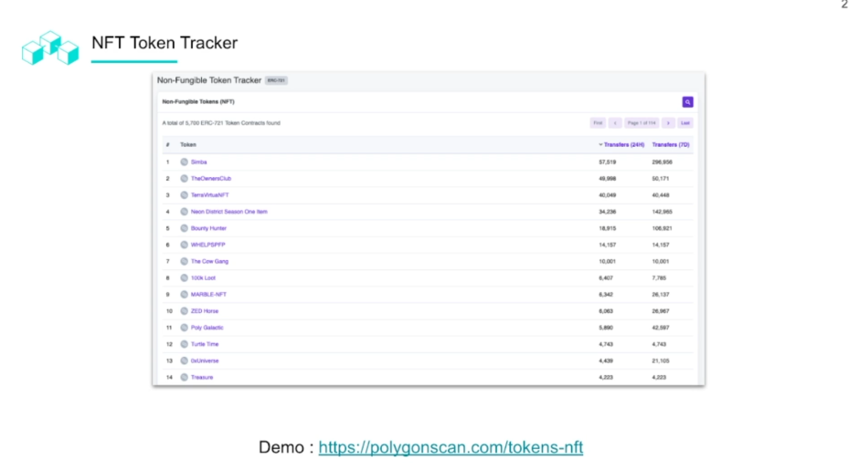

# Polygon Network Architecture

## Polygon Architecture

## Asset Flow in Plasma Bridge

## PoS Bridge (Deposit)

Root token and the child token are mapped on the PoS chain. We have it mapped on **Polygon** but we will need to map that onto the **Ethereum Mainnet**.

They need to maintain connection or mapping. Polygon has a system for submitting mapping.

MATIC SDK to interact with the contracts.

## PoS Bridge (withdrawal)

## PolygonScan Block Explorer

Like Ethscan but for polygon activity and adds a visibility layer.

Latest blocks, latest transactions, search for tokens or transactions.

Types of transactions that call functions on a contract.

## Polygon API Services

### Prerequisites

- Install Node JS
- Install yarn - `npm install -g yarn`
- Polygonscan API key

### Getting Started

- Run yarn to install dependancies
- Create `.env` file from `env.sample` and paste the Polygonscan API key there

## Polygon Gas Station

