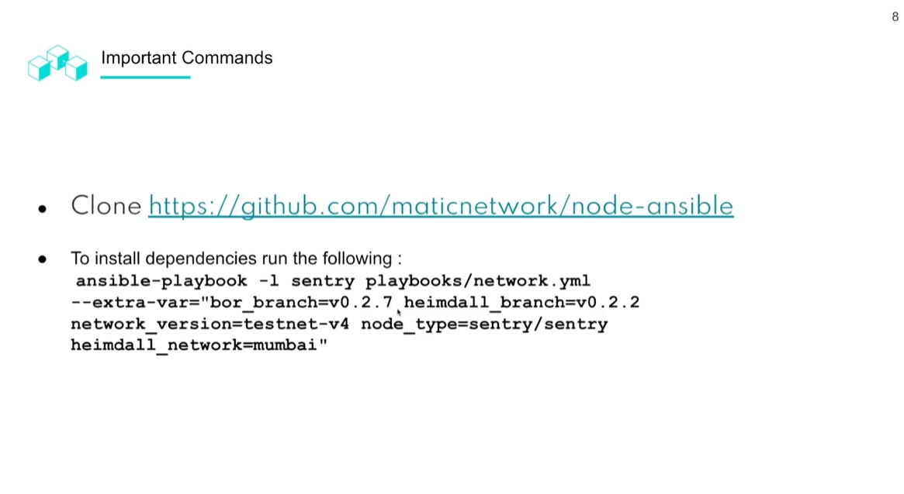

# Course Introduction

## Validator

## Requirements

## Node Setup

Grab the host and put it inside the inventory.yaml from the config.js

Able to communicate with the instance

Make sure you have added your secret key

Then run `ssh-agent`

Install all of the dependancies

Heimdell usuall takes 7 days to sync to the latest block.

